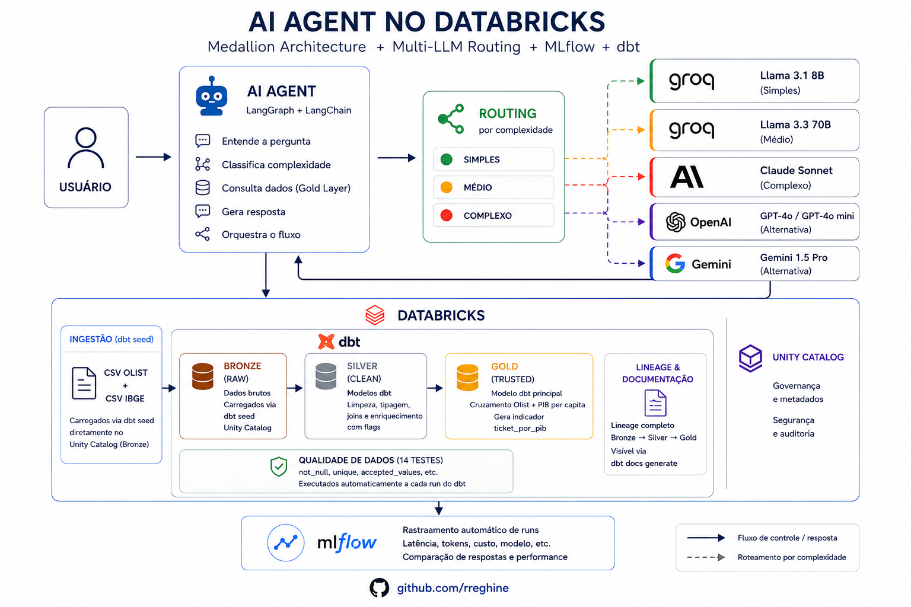
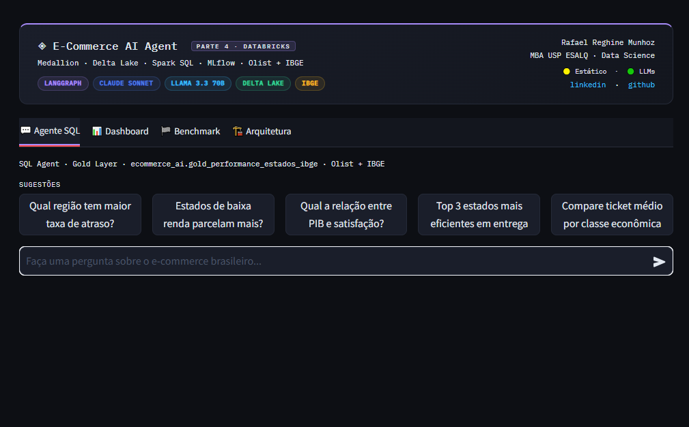
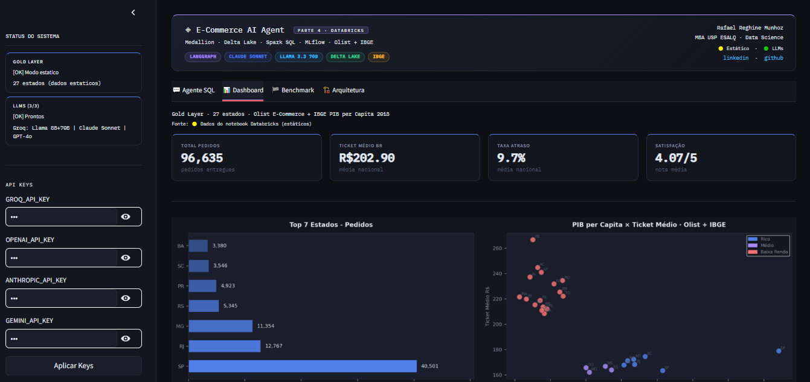
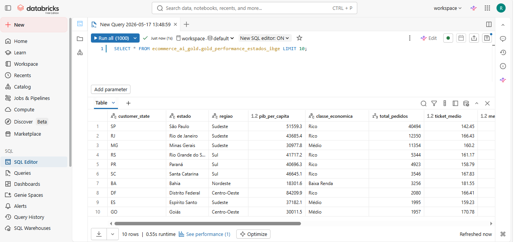

🇺🇸 **English** | [🇧🇷 Português](README.pt-BR.md)

# AI Agent — Databricks Edition


Conversational AI agent over Brazilian e-commerce data (Olist) joined with state-level GDP
per capita from IBGE (Brazil's official statistics bureau). Runs on a Medallion Architecture in
Databricks — Bronze → Silver → Gold on Delta Lake — with transformations orchestrated by dbt and
tables served through the SQL Warehouse in Unity Catalog. Automatic multi-LLM routing based on
question complexity: Llama 3.1 8B and Llama 3.3 70B (free via Groq) for simple and medium queries,
Claude Sonnet for complex ones. Live benchmark with 5 models via Groq + Claude Sonnet comparing
latency, tokens, and cost over the same Gold Layer.

---

## Preview

### Project Architecture

[](architecture.png)

### Agent Interface

[](preview_agent.PNG)

### Gold Layer Dashboard · Olist + IBGE

[](preview_dashboard.PNG)

### Gold Layer in the Databricks SQL Editor

[](preview_databricks_sql.PNG)

---

## Evolution Across Project Parts

| Component | Part 1 | Part 2 | Part 3 | Part 4 |
| --- | --- | --- | --- | --- |
| Main LLM | Google Gemma 3 | Anthropic Claude Sonnet | Llama 3.3 70B | Multi-LLM routing |
| Data | CSV + RAG + FAISS | SQLite + Text-to-SQL | SQLite | Delta Lake — Unity Catalog |
| Transformation | — | — | — | dbt (Silver + Gold) |
| SQL Engine | — | sqlite3 | sqlite3 | Spark SQL |
| Extra data | — | — | — | IBGE GDP per Capita |
| Infrastructure | Colab | Colab | Colab | Databricks Free Edition |
| Orchestrator | LangChain | LangChain | LangGraph | LangGraph |
| Observability | MLflow | MLflow | MLflow | Databricks-native MLflow |
| Benchmark models | 1 | 3 | 3 | 5 — Llama · Mistral · Qwen · Claude |
| Tabs | 2 | 4 | 4 | 4 |

---

## Architecture

```
Olist CSVs (Kaggle) + IBGE (embedded)
        |
  dbt seed → Bronze (workspace.ecommerce_ai_bronze)
        |
  dbt run  → Silver (workspace.ecommerce_ai_silver)
    |-- silver_pedidos_entregues
    |-- silver_itens_por_pedido
    |-- silver_pagamentos_por_pedido
    |-- silver_reviews_por_pedido
        |
  dbt run  → Gold (workspace.ecommerce_ai_gold)
    |-- gold_performance_estados_ibge
    |-- gold_parcelamento_por_renda
    |-- gold_kpis_consolidados
        |
  dbt test
        |
User question
        |
Guardrails — validates scope, DDL, sensitive data
        |
Complexity Classifier
    |-- simple  (<=40 words) -> Llama 3.1 8B  · Groq · free
    |-- medium  (41-80 words) -> Llama 3.3 70B · Groq · free
    |-- complex (>80 words)  -> Claude Sonnet  · Anthropic · $3/1M
        |
Text-to-SQL → Spark SQL over the Gold Layer
        |
MLflow — logs llm, tokens, cost, latency per run
        |
Streamlit — 4 tabs
    |-- SQL Agent · Dashboard · Benchmark · Architecture
```

---

## Dataset

**Brazilian E-Commerce (Kaggle)**

- 99,441 real, anonymized orders
- 7 related tables — orders, customers, products, sellers, payments, reviews
- Period: 2016 to 2018

**IBGE GDP per Capita by State (SIDRA — Table 5938)**

- 2018 state-level GDP per capita in BRL
- 27 states — embedded in the project as a dbt seed

---

## Repository Structure

```
ai-agent-databricks/
|
|-- dbt_ecommerce/                     # dbt project — Bronze, Silver, and Gold
|   |-- dbt_project.yml
|   |-- profiles.yml
|   |-- seeds/
|   |   |-- ibge_pib_estados.csv
|   |   |-- schema.yml
|   |   |-- olist_*.csv
|   |-- models/
|   |   |-- silver/
|   |   |-- gold/
|   |-- PASSO_A_PASSO_WINDOWS.md
|
|-- app.py
|-- app_databricks.py
|-- app.yaml
|-- requirements.txt
|-- README.md
```

---

## Components

### dbt — Bronze, Silver, and Gold

dbt replaces the PySpark transformations of the Silver and Gold layers. The Olist
CSVs are loaded via `dbt seed` directly into Unity Catalog as Bronze. The Silver
models clean, type, and enrich the data with joins and flags. The main Gold model
joins Olist orders with IBGE's GDP per capita and produces the `ticket_por_pib`
(average ticket vs GDP) indicator.

The 14 data quality tests automatically validate `not_null`, `unique`, and
`accepted_values` on every table on each run. The full lineage (Bronze → Silver → Gold)
is visible via `dbt docs generate`.

### Multi-LLM Routing (cost-aware)

Automatic classification based on the word count of the question. The user can
override to any model via the sidebar selector. The agent accepts API keys from
4 providers simultaneously — just configure them in the sidebar.

| Complexity | Model | Provider | Cost |
| --- | --- | --- | --- |
| simple (<=40 words) | Llama 3.1 8B | Groq | Free |
| medium (41-80 words) | Llama 3.3 70B | Groq | Free |
| complex (>80 words) | Claude Sonnet 4.6 | Anthropic | $3/1M tokens |
| override | GPT-4o Mini | OpenAI | $0.15/1M tokens |
| override | GPT-4o | OpenAI | $2.5/1M tokens |
| override | Gemini 2.0 Flash | Google | $0.10/1M tokens |
| override | Gemini 1.5 Pro | Google | $1.25/1M tokens |

### Multi-LLM Benchmark

5 models receive the same questions and query the same Gold Layer via Spark SQL.
Compared metrics: latency in ms, input/output tokens, and cost in USD.

### MLflow

Each agent call automatically logs parameters (llm, complexity, attempts),
metrics (tokens_in, tokens_out, cost_usd, latency_ms), and tags
(gold_table, part).

---

## Technologies Used

| Category | Tools |
| --- | --- |
| Language | Python 3.12 |
| Platform | Databricks Free Edition |
| Storage | Delta Lake · Unity Catalog |
| Transformation | dbt-databricks · SQL |
| SQL Engine | Databricks SQL Warehouse (Serverless) |
| Orchestration | LangGraph · LangChain |
| LLMs | Claude Sonnet 4.6 · Llama 3.1 8B · Llama 3.3 70B · GPT-4o · GPT-4o Mini · Gemini 2.0 Flash · Gemini 1.5 Pro |
| Providers | Anthropic API · Groq API (free) · OpenAI API · Google AI Studio |
| Observability | MLflow |
| Interface | Streamlit |
| Data | Olist Brazilian E-Commerce · IBGE Table 5938 |

---

## Author

**Rafael Reghine Munhoz**
Data Analyst | Data Science & Analytics

[](https://linkedin.com/in/rafaelreghine)
[](https://github.com/rreghine)
